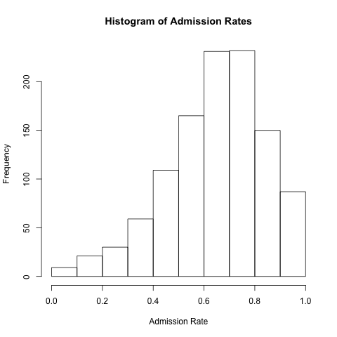
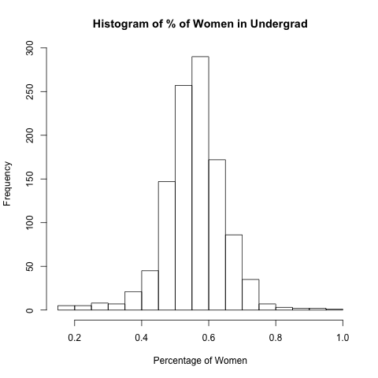
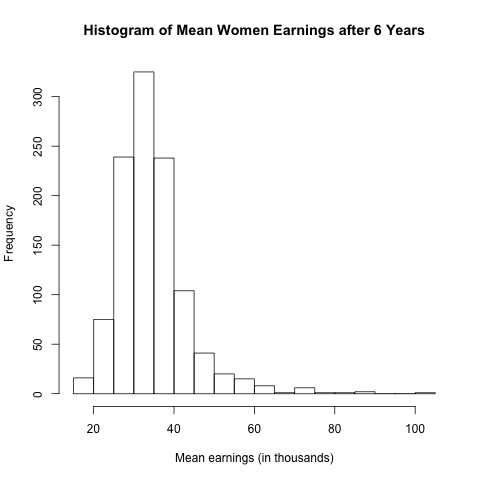
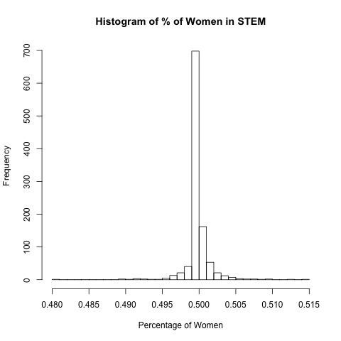
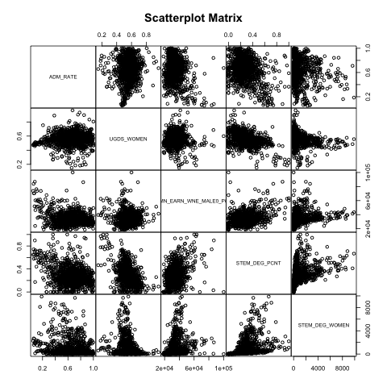

```{r setup, include=FALSE}
library(xtable)
knitr::opts_chunk$set(echo = TRUE)
load(file = "../data/eda-output.RData")
```
 
## Abstract

In this paper we will consider the data provided in \href{https://collegescorecard.ed.gov/data}{collegescorecard.ed.gov} to consult on the following issue:
\begin{center}
\emph{
"The CEO of a biotech startup is looking for candidates. She is interested in diversifying the workforce in regards to women in STEM (Science, Technology, Engineering, and Math). Where should the startup focus their recruitment and outreach for maximum impact?"
}
\end{center}
To ensure we use the newest data on recent college graduates we will only consider the most recent datafiles, ignoring older data. Next we will create a scoring system to rank colleges based on where we believe our client will have the most success in recruiting top tier female STEM majors.

## Introduction
We begin by cleaning the data. Since our raw data file contains hundreds of features, we create a new data matrix with only the desired predictors (see the Data section for further details). We also create several new features by combining columns, which imroves the regression model's interpretability by creating more consise predictors. All this is done through the 
\texttt{code/scripts/data-processing-script.R} script.

Next we consider a cross-validated linear regression to predict the mean earnings of female students working and not enrolled 6 years after entry \\
(MN\_EARN\_WNE\_MALE0\_P6) using the new data matrix, which we will use to create a scoring system for all schools. We use the mean earnings as a metric to represent the overall quality of a college's graduates, the intuition being that smarter more qualified candidates will be paid more. After preforming the regression, we check that all features are significant and use the weights of all significant terms.

## Introduction - Continued

We then use the regression equation, with only the significant terms included, to create a score for each school. After giving each collge a score, we will rank them by said score and present the top institutions to our client.

## Data
              
For our consultation we consider the following predictors: 

MN\_EARN\_WNE\_MALE0\_P6 = Mean earnings of female students working and not enrolled 6 years after entry

SATMTMID = Median SAT math score

ADM\_RATE = Admission rate

STEM\_DEG\_WOMEN = Approximate number of female STEM majors

WOMENOONLY = Indicator if schools that are only femal

HIGHDEG4 = Indicator if the school offers Bachelors degrees 

COUNT\_WNE\_MALE0\_P6 = Number of female students working and not enrolled 6 years after entry

These predictors will be used to create a regression model predicting and, ultimately, create a score for each school.

## Data - Continued

We chose the variables that seemed the most predictable of technical job performance and the variables that were about number of females in technical fields at a school. The combination of these two types of features will yield the best schools to target (in terms of number of potential recruits as well as recruit's skill level)

In cleaning the data, we decided to remove entries that contained missing values. If there was a missing value of the features we used, we removed that row from the dataset. Other notable operations we performed on the data to clean it included removing schools that were no longer in operation, removing schools with only male students, and removing schools that specialize in a non-stem field (i.e. associate colleges). We only kept schools that have a predominant degree type listed as well as schools that offer at least bachelors degrees.

## Data - Continued

We had to change the data type of most columns either to numeric or a factor. We added in a few columns of our own based off of the information given to us. These included columns such as the percentage of engineering/math/science/tech degrees awarded. We also calculated the number of STEM degrees awarded to women based off of a series of conditions. We did this so that we could analyze the data in terms that would be valuable to our client.

In addition to cleaning the dataset, we also created dummy variables for categorical variables. We also chose to mean center and standardize our variables to allow for accurate predictions and more straight-forward analysis.

## Data - Continued

To initially explore the data, we first broke up the dataset into general data, including:

ADM\_RATE

SATMTMID

UGDS\_WOMEN

MN\_EARN\_WNE\_MALE0\_P6

COUNT\_WNE\_MALE0\_P6

## Data - Continued

We note several interesting statistics: 

The first being that the average admission rate is $0.647$, which is for colleges in general. The mean SAT score for these schools is $531$ out of the $770$ maximum score, indicating that the mean SAT score for these schools is slightly below the median of $520$. To turn our attention to focus on the data we have on women, we look at the number of undergrads enrolled in schools. The mean is actually above $0.50$, indicating that more than half of the student body is made up of women. 

## Data - Continued

The mean earnings of women after 6 years of graduating hovers at around \$34,000, while the maximum earnings reach \$100,100. We note the high range of salaries, with a range of almost \$80,000. The number of females working after 6 years is on average 1,000 and also has a relatively high range of 8,650. 

## Data - Continued

In the visualization below we note that admission rates center in the 60-80\% range.



## Data - Continued
The histogram of the prearrange of women in undergrad is a visualization of the fact that there are over 0.50 women in most undergraduate student bodies.


## Data - Continued
The histogram of mean women earnings after 6 years displays the wide spread in incomes we found in the data. We see the majority of incomes below \$50,000, with a very small frequency of incomes above that mark.


The next section of data we chose to explore were the degree types, namely the number of science, math and engineering type degrees. Shown in a table below, the means for these degrees range, with the highest average percentage in PCIP26, which is a science type of degree. The lowest average degree type is PCIP41, which is another type of science type degree.

## Data - Continued

The visualization below shows a histogram of the total number of STEM degrees awarded, and we see a large percentage clustered below 5,000. The visualization directly following shows the percentage of these STEM degrees awarded to women. For this histogram we removed the schools with only women, and also only kept schools where there was some number of STEM degrees awarded to women. We see that the highest frequency is just below 0.50, and the spread is relatively small, between 0.48-0.52, meaning that most schools award a equal percentage of STEM degrees to women and men.

## Data - Continued



## Data - Continued

We wanted a way to see the correlations between variables in this dataset. To create our correlation matrix, we chose a few variables which we thought would have interesting correlations to study. For this we chose ADM\_RATE, UGDS\_WOMEN, MN\_EARN\_WNE\_MALE0\_P6, WOMEN\_TOTAL, and STEM\_DEG\_WOMEN. 

In the table below, we can see the correlations between these variables. There seems to be a very strong correlation between the mean earnings of women after 6 years and the number of stem degrees awarded to women. From this we can gather that women with degrees in STEM might have higher average earnings than other degrees. Other strong correlations to note are the admission rates and the number of undergraduate women at a school, as well as the mean earnings of women and the total percentage of STEM degrees awarded at a school. 

## Data - Continued
We can see a visualization of these relationships below as well.



## Methods

In order to properly consult our client, we build score function and apply it to each school, recommending the top institutions to our client. To create the score function we use ordinary least squares regression (OLS) and cross validation.

OLS is an approach to predicting a quantitative response $Y$ based on a multiple predictor variables $X_1$ through $X_p$, where $Y$ and $X_1$ through $X_p$ are vectors and each value in each $X_{ij}$ ($x_{ij}$) has a corresponding value in $Y$ ($y_i$). The model assumes that the relationship between every $X_i$ and $Y$ is linear and that each $X_j$ isn't correlated with any other $X_j$. OLS can be written as $Y \approx \beta_0 + \beta_1X_1 + \beta_2X_2 + ... + \beta_pX_p + \epsilon$, where $\beta_0$ is the intercept and $\beta_1$ through $\beta_p$ are the slopes of their corresponding predictor variable $X_j$. 

## Methods - Continued

The beta values are all constants, unknowns, and together are the model coefficients. The interpretation of $\beta_0$ is the expected mean value of $Y$ without a predictor variable and the interpretation of $\beta_1$ through $\beta_p$ is the change in $Y$ for a unit increase in the beta's corresponding $X_j$. Although the betas are unknown, we can estimate them using the OLS model: solving for the intercept and slopes that produce the plane closest to each point ($x_{ij}$,$y_i$) in each $X_j$,$Y$, which is minimizing the residual sum of squares ($RSS$). Once we have an estimate for the betas, we can compute using OLS to determine the strength of the relationship between each $X_j$ and $Y$, if the relationship is statistically significant, and asses how accurately the model predicts the relationship.

## Methods - Continued

Cross-validation is a model validation technique used to assess how the results of an analysis will generalize to an independent data set. To cross-validate a model, we fit its required estimated parameters using k parts of a training dataset and then test the k created models on an unseen test dataset. We then chose the model that minimizes the predictive error. If the model performs well using the test dataset (meaning it has a low predictive error), we are more confident that this model is accurate (since it produces good prediction of data not used to fit the model). For our purposes, we will cross validate the resulting model from our OLS regression and choose the $\beta$ vector that has the minimal cross-validated mean squared error.

## Analysis

```{r echo = FALSE, cache = FALSE}
# load any libraries neeed
library(xtable)

# load models
load(file = "../data/regression-results.RData")
load(file = "../data/ordered-schools.RData")
```

After running our regression script we observed the following values for our $\hat{\beta}_{OLS}$ estimator:

```{r xtable, results = "asis", fig = TRUE, include =TRUE, echo = FALSE, eval=TRUE}
# load any libraries neeed
betas = round(as.numeric(regression$coefficients), 4)
options(xtable.comment = F)
t1 = xtable(summary(regression)$coefficients, caption = "Predictor Significance")
print.xtable(t1, type ="html")
```

It's clear from the final column of the tabel that all the regressors are significant (with the exception of the intercept). Thus, we will utilize all values \emph{except} the intercept in our score function.

## Analysis - Continued
We use OLS and only OLS because we wanted to use all of the features and there are very few features we're considering. If anything, we're lacking in features (due to the limitations of the initial dataset). The mean squared error of the prediction was `r sum(regression$residuals^2)/length(regression$residuals)`. The mean squared error tells us how accurate the prediction is. However, we're not trying to predict salary, we simply was to see the magnitude of each feature on salary and then use these magnitudes as weights to determine the score of a school: predictability doesn'tmatter, just the magnitude of each feature. We chose salary as the response because we made the assumption that salary was a good measure of how well an employee preformed.

## Results
```{r echo = FALSE, cache = FALSE}
# load any libraries neeed
library(xtable)

# load models
load(file = "../data/regression-results.RData")
load(file = "../data/ordered-schools.RData")
```

From our $10$-fold cross validation we observe a mean squared error of: `r round(cv_ms, 4)`

Next we build the score function, utilizing the above $\hat{\beta}_{OLS}$ values as the weights for our function. This yields the following expression:

f(X$_{\cdot,i})$ \coloneqq (`r betas[2]`) X$_{1,i}$ + `r betas[3]` X$_{2,i}$ + (`r betas[4]`)  X$_{3,i}$ + `r betas[5]`  X$_{4,i}$ + `r betas[6]`   X$_{5,i}$ + `r betas[7]`   X$_{6,i}$

## Results - Continued
```{r echo = FALSE, cache = FALSE}
# load any libraries neeed
library(xtable)

# load models
load(file = "../data/regression-results.RData")
load(file = "../data/ordered-schools.RData")
```

Where $X_{j,i}$ represents the j-th regressor value from our OLS regression of the i-th observation in the data matrix. Using this equation, we apply it to all schools in our data matrix and sort by their relative score to yield the top 10 colleges we recomend the client recruits from:
```{r, results = "asis", fig = TRUE, include =TRUE, echo = FALSE}
# load any libraries neeed
betas = round(as.numeric(regression$coefficients), 4)
options(xtable.comment = F)
t1 = xtable(ordered_schools[1:10,31:33], caption = "Top 10 Colleges to Recruit From")
print.xtable(t1, type ="html", include.rownames = FALSE)
```

## Recommedations

After preforming a preliminary examination of the data, building the previously detailed OLS regression model, and building our score function, we recommend our client recruit from the top 10 schools given in the previous slide.

It should be noted that our score function is derrived from our regression model, with the coefficients used were the same $\beta$ values becoming the weights in the function. Using this data, we are sure our client will be able to recruit highly qualified female STEM majors for her company.

## Considerations

One major shortcoming of our analysis for this project was that we didn't have exact statistics for the number of females graduating in each STEM major type, but instead had to assume that half of the STEM majors were female. In reality this might have been an overestimate, but this was the closest approximation given the data provided.

In analyzing the quality of students at a particular school, we would have liked to look at GPA as an indicator of one's intelligence rather than SAT Math scores.

## Conclusions
```{r echo = FALSE, cache = FALSE}
# load any libraries neeed
library(xtable)

# load models
load(file = "../data/regression-results.RData")
load(file = "../data/ordered-schools.RData")
```
After considering the request of our client, we filtered the data, built an OLS regression model, considered the significance of the coefficients, and built a comprehensive scoring function for any given college. Using this we were abel to recommend the following 10 universities to recruit from given in the prior slides.

It should be noted that the structure of this paper allows for it to be reproduced with each new data upload on \href{https://collegescorecard.ed.gov/data}{collegescorecard.ed.gov}

